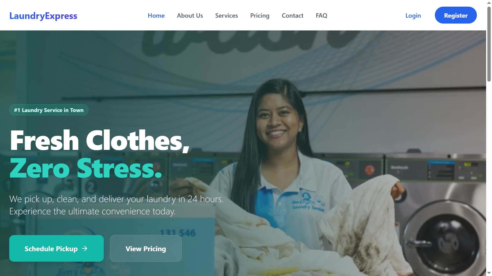

# 🧺 Laundry Pickup & Delivery Management System - Frontend

[](https://reactjs.org/)
[](https://github.com/KawyaDissanayaka/laundry-pickup-delivery-management-system-frontend)
[](https://github.com/KawyaDissanayaka/laundry-pickup-delivery-management-system-frontend/commits)
[](https://github.com/KawyaDissanayaka/laundry-pickup-delivery-management-system-frontend)

---

## 📊 Project Insights & Contributors


### 👥 Contributors Overview

<div align="center">

<table>
  <tr>
    <th></th>
    <th>Contributor</th>
    <th>Role</th>
    <th>Frontend Commits</th>
    <th>Backend Commits</th>
    <th>UI Design</th>
    <th>Postman Testing</th>
    <th>Total Contributions</th>
  </tr>
  <tr>
    <td align="center">
      <a href="https://github.com/KawyaDissanayaka">
        
      </a>
    </td>
    <td>
      <a href="https://github.com/KawyaDissanayaka">
        <b>Kawya Dissanayaka</b><br/>
        <sub>@KawyaDissanayaka</sub>
      </a>
    </td>
    <td>🎯 Lead Developer<br/>📦 Project Owner</td>
    <td align="center"><b>24+</b></td>
    <td align="center"><b>20+</b></td>
    <td align="center">✅</td>
    <td align="center">✅</td>
    <td align="center"><b>🏆 44+</b></td>
  </tr>
  <tr>
    <td align="center">
      <a href="https://github.com/DarshanaChinthaka">
        
      </a>
    </td>
    <td>
      <a href="https://github.com/DarshanaChinthaka">
        <b>Darshana Chinthaka</b><br/>
        <sub>@DarshanaChinthaka</sub>
      </a>
    </td>
    <td>⚙️ Backend Developer<br/>🗄️ Database Specialist</td>
    <td align="center">-</td>
    <td align="center"><b>6+</b></td>
    <td align="center">✅</td>
    <td align="center">-</td>
    <td align="center"><b>🥈 6+</b></td>
  </tr>
  <tr>
    <td align="center">
      <a href="https://github.com/shanilka1">
        
      </a>
    </td>
    <td>
      <a href="https://github.com/shanilka1">
        <b>Shanilka Lakshan</b><br/>
        <sub>@shanilka1</sub>
      </a>
    </td>
    <td>🎨 Frontend Developer<br/>💻 UI Implementation</td>
    <td align="center"><b>4+</b></td>
    <td align="center">-</td>
    <td align="center">✅</td>
    <td align="center">-</td>
    <td align="center"><b>🥉 4+</b></td>
  </tr>
  <tr>
    <td align="center">
      <a href="https://github.com/nimashagayathri">
        
      </a>
    </td>
    <td>
      <a href="https://github.com/nimashagayathri">
        <b>Nimasha Gayathri</b><br/>
        <sub>@nimashagayathri</sub>
      </a>
    </td>
    <td>🎨 UI/UX Designer<br/>🖌️ Design Contributor</td>
    <td align="center">-</td>
    <td align="center">-</td>
    <td align="center">✅</td>
    <td align="center">-</td>
    <td align="center">🎨 Design</td>
  </tr>
  <tr>
    <td align="center">
      <a href="https://github.com/minidu1">
        
      </a>
    </td>
    <td>
      <a href="https://github.com/minidu1">
        <b>Minidu</b><br/>
        <sub>@minidu1</sub>
      </a>
    </td>
    <td>👥 Team Member<br/>🤝 Contributor</td>
    <td align="center">-</td>
    <td align="center">-</td>
    <td align="center">-</td>
    <td align="center">-</td>
    <td align="center">🤝 Support</td>
  </tr>
</table>

</div>

---

## 👥 Top Contributors

| Rank | Contributor | Frontend Commits | Backend Commits | UI Design | Postman | Total Contributions |
|------|-------------|-----------------|----------------|-----------|---------|-------------------|
| 1 | [@KawyaDissanayaka](https://github.com/KawyaDissanayaka) | 83 | 50 | - | - | 133 |
| 2 | [@shanilka1](https://github.com/shanilka1) | 21 | 0 | - | - | 21 |
| 3 | [@DarshanaChinthaka](https://github.com/DarshanaChinthaka) | 0 | 7 | - | - | 7 |
| 4 | - | - | - | - | - | - |
| 5 | - | - | - | - | - | - |
| 6 | - | - | - | - | - | - |
| 7 | - | - | - | - | - | - |
| 8 | - | - | - | - | - | - |
| 9 | - | - | - | - | - | - |
| 10 | - | - | - | - | - | - |

## Branch Contributors

| Contributor | Frontend Commits | Backend Commits | UI Design | Postman Testing | Branch Commits | Total Contributions |
|------------|------------------|----------------|-----------|----------------|----------------|---------------------|
| [@KawyaDissanayaka](https://github.com/KawyaDissanayaka) | X | X | ✓ | ✓ | X | X |
| [@DarshanaChinthaka](https://github.com/DarshanaChinthaka) | X | X | ✓ | - | X | X |
| [@shanilka1](https://github.com/shanilka1) | X | X | ✓ | - | X | X |
| [@nimashagayathri](https://github.com/nimashagayathri) | X | X | ✓ | - | X | X |
| [@minidu1](https://github.com/minidu1) | X | X | - | - | X | X |
| Contributor 6 | X | X | - | - | X | X |
| Contributor 7 | X | X | - | - | X | X |
| Contributor 8 | X | X | - | - | X | X |
| Contributor 9 | X | X | - | - | X | X |
| Contributor 10 | X | X | - | - | X | X 


### 📈 Repository Statistics

<div align="center">

| 📦 Metric | 📊 Value |
|-----------|----------|
| **Total Commits** | 30+ |
| **Active Contributors** | 5 |
| **Primary Language** | JavaScript (99.4%) |
| **Framework** | React.js |
| **Last Updated** | Feb 13, 2026 |
| **Project Duration** | 2 Months |

</div>

---

### 🔥 Development Activity Timeline


---

### 🎯 Contribution Breakdown

<div align="center">

| Contribution Type | Lead Contributor | Count | Status |
|-------------------|------------------|-------|--------|
| 🎨 **UI Components** | KawyaDissanayaka, shanilka1 | 15+ | ✅ Complete |
| 🔐 **Authentication Pages** | KawyaDissanayaka | 5+ | ✅ Complete |
| 📦 **Order Management UI** | KawyaDissanayaka | 8+ | ✅ Complete |
| 🎨 **UI/UX Design** | nimashagayathri, KawyaDissanayaka | - | ✅ Complete |
| 📚 **Documentation** | KawyaDissanayaka | 10+ | ✅ Complete |
| 🐛 **Bug Fixes** | KawyaDissanayaka, shanilka1 | 5+ | ✅ Complete |

</div>

---

### 🏆 Top Contributors Hall of Fame

<div align="center">

#### 🥇 Gold Medal - Lead Developer
<a href="https://github.com/KawyaDissanayaka">
  
</a>

**Kawya Dissanayaka**


---

#### 🥈 Silver Medal - Frontend Specialist
<a href="https://github.com/shanilka1">
  
</a>

**Shanilka Lakshan**


---

#### 🥉 Bronze Medal - Design Excellence
<a href="https://github.com/nimashagayathri">
  
</a>

**Nimasha Gayathri**


</div>

---

### 📦 Project Milestones

<div align="center">

| 🎯 Milestone | 📅 Date | ✅ Status |
|--------------|---------|-----------|
| Project Setup & Configuration | Dec 15, 2025 | ✅ Complete |
| UI Component Development | Dec 15-16, 2025 | ✅ Complete |
| Authentication System | Jan 19, 2026 | ✅ Complete |
| Order Management Interface | Feb 04, 2026 | ✅ Complete |
| Bug Fixes & Optimization | Feb 06, 2026 | ✅ Complete |
| Documentation & Screenshots | Feb 12-13, 2026 | ✅ Complete |

</div>

---

### 🔗 Quick Links

<div align="center">

[](https://github.com/KawyaDissanayaka/laundry-pickup-delivery-management-system-frontend/graphs/contributors)
[](https://github.com/KawyaDissanayaka/laundry-pickup-delivery-management-system-frontend/commits)
[](https://github.com/KawyaDissanayaka/laundry-pickup-delivery-management-system-frontend/issues)
[](https://github.com/KawyaDissanayaka/laundry-pickup-delivery-management-system-backend)

</div>

---

### 💡 Development Statistics

<table align="center">
<tr>
<td align="center" width="25%">
  
  <h3>30+</h3>
  <p>Total Commits</p>
</td>
<td align="center" width="25%">
  
  <h3>5</h3>
  <p>Contributors</p>
</td>
<td align="center" width="25%">
  
  <h3>99.4%</h3>
  <p>JavaScript</p>
</td>
<td align="center" width="25%">
  
  <h3>2</h3>
  <p>Months Active</p>
</td>
</tr>
</table>

---

<div align="center">

### 🙏 Thank You to All Contributors!


**Last Updated:** February 13, 2026

</div>

---

## 📝 Note

> **Commit counts are based on the most recent 30 commits.** For complete contribution history, please visit the [Insights page](https://github.com/KawyaDissanayaka/laundry-pickup-delivery-management-system-frontend/graphs/contributors).

)

A **React-based frontend application** designed to manage laundry pickup and delivery services.  
The system allows customers to schedule pickups, track orders, and manage laundry requests through a clean and responsive user interface.

---

## 🌟 Features

### Customer Features
- Register and login user accounts
- Schedule laundry pickup requests
- Select laundry service types (Wash, Dry Clean, Iron)
- View and track order status
- Order history management
- Update profile information

### Admin / Staff Features
- View all laundry orders
- Update order status (Pending, Picked, Processing, Delivered)
- Manage customer information
- Dashboard with order summaries
- Manage pickup and delivery schedules

### System Features
- REST API integration with backend
- Responsive mobile-friendly UI
- Reusable React components
- Form validation and error handling
- Notification alerts for order updates

---

## ⚡ Tech Stack

- **Frontend Framework:** React.js
- **Languages:** JavaScript, HTML5, CSS3
- **Package Manager:** Node.js, npm
- **State Management:** React Hooks / Context API
- **Backend Integration:** REST APIs (Spring Boot / Node.js)
- **UI Libraries:** Bootstrap / Material UI (optional)

---

## 📸 Screenshots

> Create a folder called `screenshots` inside our project and add images there.

### 🏠 Home Page


### 📦 Order Dashboard


### ➕ Schedule Pickup


### 📋 Order Management (Admin)


---

## 🚀 Getting Started

### 1. Clone the repository
```bash
git clone https://github.com/KawyaDissanayaka/laundry-pickup-delivery-management-system-frontend
.git
cd laundrymart-frontend
```

### 1. Install dependencies

```
npm install
```

 ### 2. Run the application

```
npm start
```

### Application runs at:

```
http://localhost:3000
```
  


🔗 Backend Integration

The frontend connects to the backend REST API:

```
http://localhost:8080/api
```


### 📁 Project Structure

```
laundry-frontend/
├─ public/
├─ src/
│  ├─ components/        # Reusable UI components
│  ├─ pages/             # Application pages
│  ├─ services/          # API calls
│  ├─ assets/            # Images and styles
│  ├─ App.js
│  └─ index.js
├─ package.json
└─ README.md
```


### 📝 License

This project is licensed under the MIT License.
You are free to use, modify, and distribute this software.

### 💡 Future Improvements

```
💳 Online Payments
📍 Live Order Tracking
📱 Mobile App Version
📊 Advanced Analytics Dashboard
```

