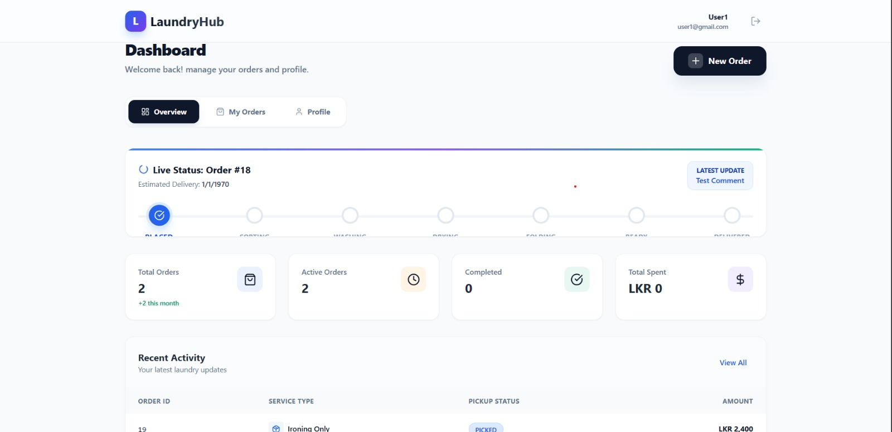
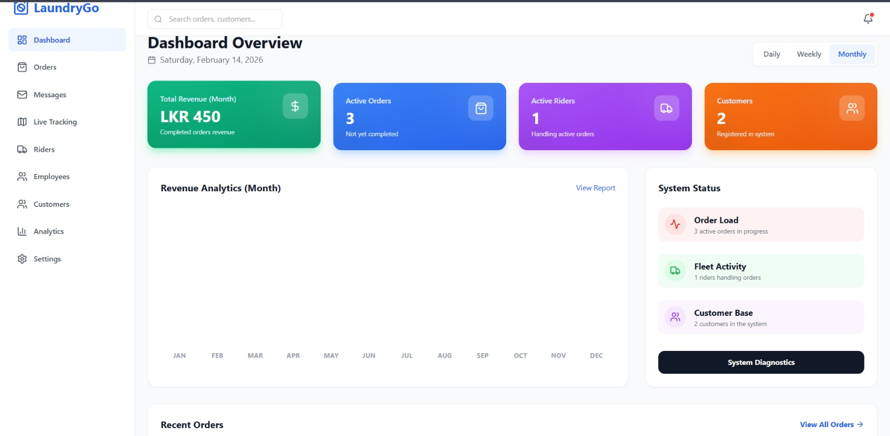
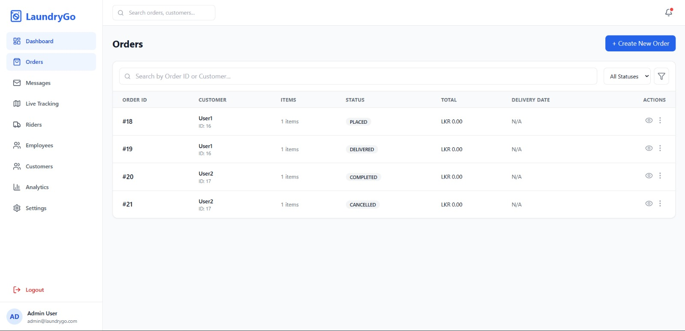
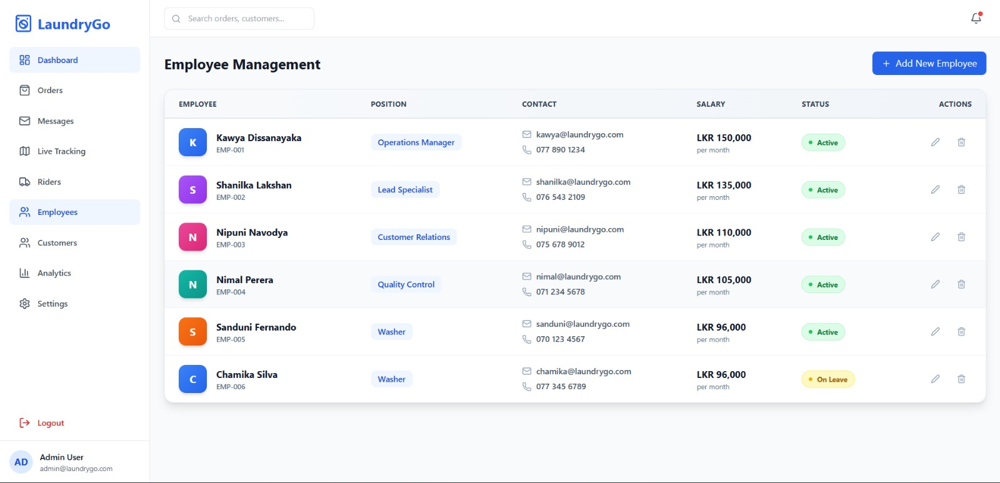
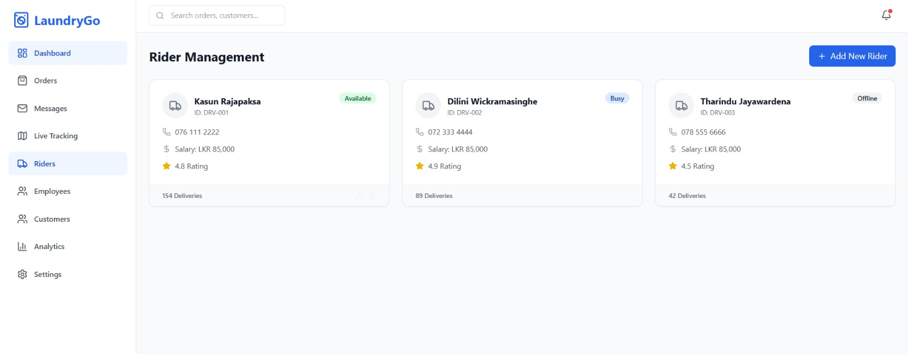
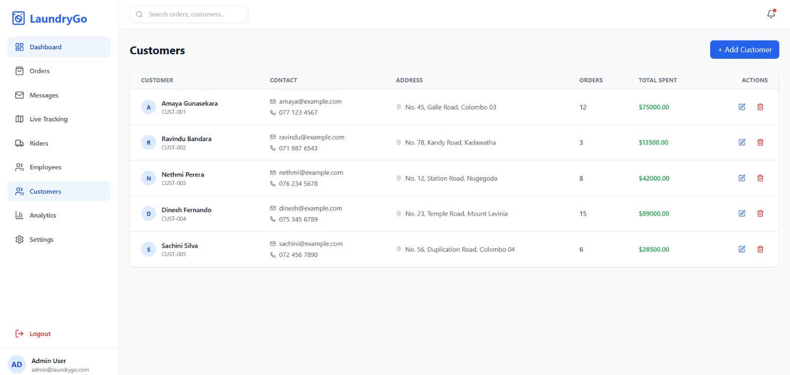
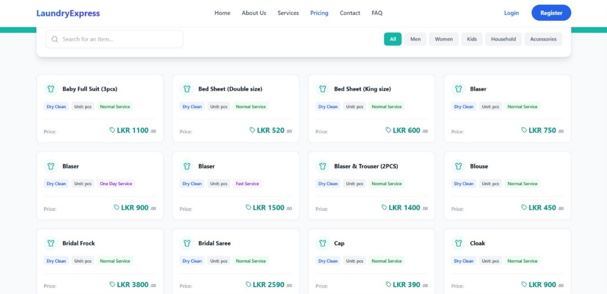

# 🧺 Laundry Pickup & Delivery Management System - Frontend

[](https://reactjs.org/)
[](https://github.com/KawyaDissanayaka/laundry-pickup-delivery-management-system-frontend)
[](https://github.com/KawyaDissanayaka/laundry-pickup-delivery-management-system-frontend/commits)
[](https://github.com/KawyaDissanayaka/laundry-pickup-delivery-management-system-frontend)

---

A **React-based frontend application** designed to manage laundry pickup and delivery services.  
The system allows customers to schedule pickups, track orders, and manage laundry requests through a clean and responsive user interface.

---

## 🌟 Features

### Customer Features
- Register and login user accounts
- Schedule laundry pickup requests
- Select laundry service types (Wash, Dry Clean, Iron)
- View and track order status
- Order history management
- Update profile information

### Admin / Staff Features
- View all laundry orders
- Update order status (Pending, Picked, Processing, Delivered)
- Manage customer information
- Dashboard with order summaries
- Manage pickup and delivery schedules

### System Features
- REST API integration with backend
- Responsive mobile-friendly UI
- Reusable React components
- Form validation and error handling
- Notification alerts for order updates

---

## ⚡ Tech Stack

- **Frontend Framework:** React.js
- **Languages:** JavaScript, HTML5, CSS3
- **Package Manager:** Node.js, npm
- **State Management:** React Hooks / Context API
- **Backend Integration:** REST APIs (Spring Boot / Node.js)
- **UI Libraries:** Bootstrap / Material UI (optional)

---

## 📸 Screenshots

> Create a folder called `screenshots` inside our project and add images there.

### 🏠 Home Page


### 📦 Order Dashboard


### ➕ Schedule Pickup


### 📋 Order Management (Admin)


### 👨‍💼 Employee Management (Admin)


- Add / Edit / Delete Employees  
- Assign roles (Admin, Staff)  
- View employee activity  
- Manage employee status  

### 🛵 Rider Management (Admin)


- Assign riders to orders  
- Track rider availability  
- Update delivery status  
- View rider performance  

### 👥 Customer Management (Admin)


- View registered customers  
- Edit customer information  
- Monitor customer orders  
- Manage account status  

### 💰 Pricing Page


- Service-based pricing (Wash, Dry Clean, Iron)  
- Transparent cost breakdown  
- Easy price comparison 

---

## 🚀 Getting Started

### 1. Clone the repository
```bash
git clone https://github.com/KawyaDissanayaka/laundry-pickup-delivery-management-system-frontend
.git
cd laundrymart-frontend
```

### 1. Install dependencies

```
npm install
```

 ### 2. Run the application

```
npm start
```

### Application runs at:

```
http://localhost:3000
```
  


🔗 Backend Integration

The frontend connects to the backend REST API:

```
http://localhost:8080/api
```


### 📁 Project Structure

```
laundry-frontend/
├─ public/
├─ src/
│  ├─ components/        # Reusable UI components
│  ├─ pages/             # Application pages
│  ├─ services/          # API calls
│  ├─ assets/            # Images and styles
│  ├─ App.js
│  └─ index.js
├─ package.json
└─ README.md
```

### 🏆 Top Contributors Hall of Fame

<div align="center">

<table>
<tr>
<td align="center" width="33%">

#### 🥇 Gold Medal - Lead Developer

<a href="https://github.com/KawyaDissanayaka">
  
</a>

### **Kawya Dissanayaka**

<sub>@KawyaDissanayaka</sub>


**🎯 Key Contributions:**
- Project Architecture & Setup
- Full Stack Development
- UI/UX Implementation
- API Integration & Testing
- Documentation & Leadership

</td>
<td align="center" width="33%">

#### 🥈 Silver Medal - Frontend Specialist

<a href="https://github.com/shanilka1">
  
</a>

### **Shanilka Lakshan**

<sub>@shanilka1</sub>


**💻 Key Contributions:**
- React Component Development
- UI Implementation
- Frontend Feature Development
- Code Optimization

</td>
<td align="center" width="33%">

#### 🥉 Bronze Medal - Backend & Design

<a href="https://github.com/DarshanaChinthaka">
  
</a>

### **Darshana Chinthaka**

<sub>@DarshanaChinthaka</sub>


**⚙️ Key Contributions:**
- Backend API Development
- Database Design
- API Testing & Documentation
- System Integration

</td>
</tr>
</table>

---

### 🎨 Special Recognition

<table>
<tr>
<td align="center" width="50%">

<a href="https://github.com/nimashagayathri">
  
</a>

**Nimasha Gayathri**

<sub>@nimashagayathri</sub>


**🎨 Design Contributions**
- UI/UX Design
- Design System
- User Experience

</td>
<td align="center" width="50%">

<a href="https://github.com/minidu1">
  
</a>

**Minidu**

<sub>@minidu1</sub>


**🤝 Team Contributions**
- Project Support
- Collaboration
- Team Coordination

</td>
</tr>
</table>

</div>

---

### 📊 Contribution Impact

<div align="center">

| 🏅 Achievement | 👤 Contributor | 🎯 Category | 🌟 Impact Level |
|---------------|----------------|-------------|-----------------|
| 🏆 **Most Commits** | @KawyaDissanayaka | Full Stack | ⭐⭐⭐⭐⭐ |
| 💻 **Frontend Champion** | @shanilka1 | Frontend | ⭐⭐⭐⭐ |
| ⚙️ **Backend Expert** | @DarshanaChinthaka | Backend | ⭐⭐⭐⭐ |
| 🎨 **Design Lead** | @nimashagayathri | UI/UX | ⭐⭐⭐ |
| 🤝 **Team Player** | @minidu1 | Support | ⭐⭐⭐ |

</div>


### 📈 Repository Statistics

<div align="center">

| 📦 Metric | 📊 Value |
|-----------|----------|
| **Total Commits** | 30+ |
| **Active Contributors** | 5 |
| **Primary Language** | JavaScript (99.4%) |
| **Framework** | React.js |
| **Last Updated** | Feb 13, 2026 |
| **Project Duration** | 2 Months |

</div>


---

### 🎯 Contribution Breakdown

<div align="center">

| Contribution Type | Lead Contributor | Count | Status |
|-------------------|------------------|-------|--------|
| 🎨 **UI Components** | KawyaDissanayaka, shanilka1 | 15+ | ✅ Complete |
| 🔐 **Authentication Pages** | KawyaDissanayaka | 5+ | ✅ Complete |
| 📦 **Order Management UI** | KawyaDissanayaka | 8+ | ✅ Complete |
| 🎨 **UI/UX Design** | nimashagayathri, KawyaDissanayaka | - | ✅ Complete |
| 📚 **Documentation** | KawyaDissanayaka | 10+ | ✅ Complete |
| 🐛 **Bug Fixes** | KawyaDissanayaka, shanilka1 | 5+ | ✅ Complete |

</div>

---


### 📦 Project Milestones

<div align="center">

| 🎯 Milestone | 📅 Date | ✅ Status |
|--------------|---------|-----------|
| Project Setup & Configuration | Dec 15, 2025 | ✅ Complete |
| UI Component Development | Dec 15-16, 2025 | ✅ Complete |
| Authentication System | Jan 19, 2026 | ✅ Complete |
| Order Management Interface | Feb 04, 2026 | ✅ Complete |
| Bug Fixes & Optimization | Feb 06, 2026 | ✅ Complete |
| Documentation & Screenshots | Feb 12-13, 2026 | ✅ Complete |

</div>

---

### 🔗 Quick Links

<div align="center">

[](https://github.com/KawyaDissanayaka/laundry-pickup-delivery-management-system-frontend/graphs/contributors)
[](https://github.com/KawyaDissanayaka/laundry-pickup-delivery-management-system-frontend/commits)
[](https://github.com/KawyaDissanayaka/laundry-pickup-delivery-management-system-frontend/issues)
[](https://github.com/KawyaDissanayaka/laundry-pickup-delivery-management-system-backend)

</div>

---

### 💡 Development Statistics

<table align="center">
<tr>
<td align="center" width="25%">
  
  <h3>30+</h3>
  <p>Total Commits</p>
</td>
<td align="center" width="25%">
  
  <h3>5</h3>
  <p>Contributors</p>
</td>
<td align="center" width="25%">
  
  <h3>99.4%</h3>
  <p>JavaScript</p>
</td>
<td align="center" width="25%">
  
  <h3>2</h3>
  <p>Months Active</p>
</td>
</tr>
</table>

---

<div align="center">

### 🙏 Thank You to All Contributors!


**Last Updated:** February 13, 2026

</div>

---

## 📝 Note

> **Commit counts are based on the most recent 30 commits.** For complete contribution history, please visit the [Insights page](https://github.com/KawyaDissanayaka/laundry-pickup-delivery-management-system-frontend/graphs/contributors).

)


### 📝 License

This project is licensed under the MIT License.
You are free to use, modify, and distribute this software.

### 💡 Future Improvements

```
💳 Online Payments
📍 Live Order Tracking
📱 Mobile App Version
📊 Advanced Analytics Dashboard
```

## 📞 Contact

**Kawya Dissanayaka**
- GitHub: [@KawyaDissanayaka](https://github.com/KawyaDissanayaka)
- Repository: [Frontend](https://github.com/KawyaDissanayaka/laundry-pickup-delivery-management-system-frontend) | [Backend](https://github.com/KawyaDissanayaka/laundry-pickup-delivery-management-system-backend)

---

## 🔗 Related Repositories

- **Backend API**: [laundry-pickup-delivery-management-system-backend](https://github.com/KawyaDissanayaka/laundry-pickup-delivery-management-system-backend)

---